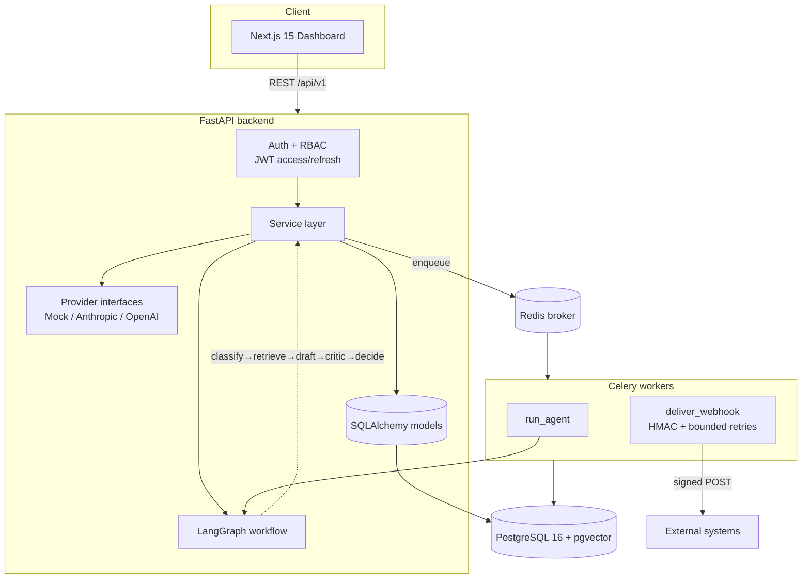
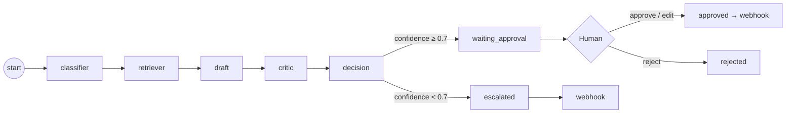
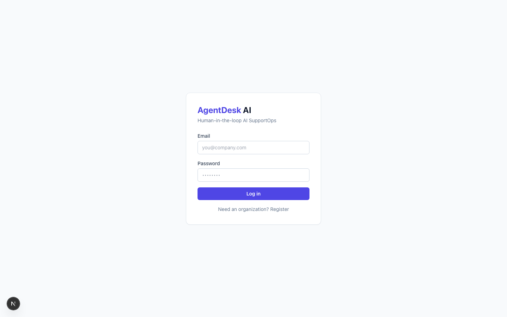
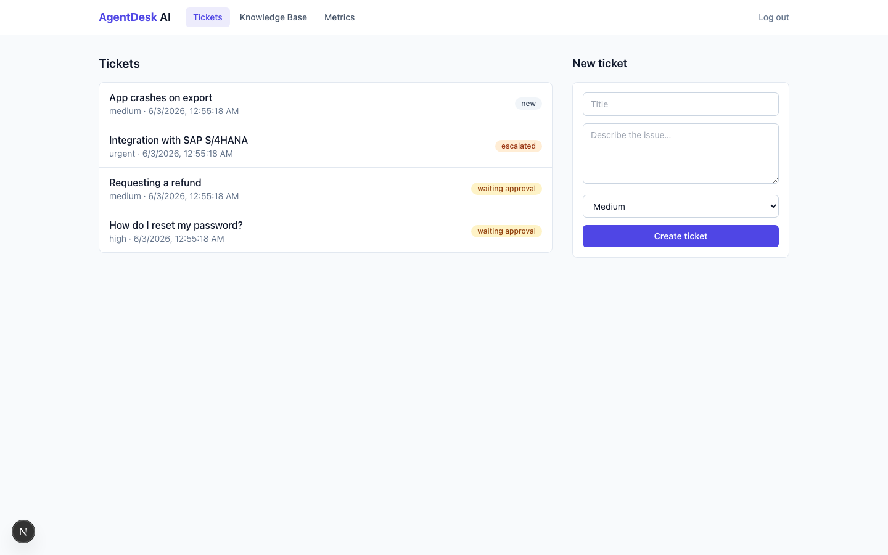
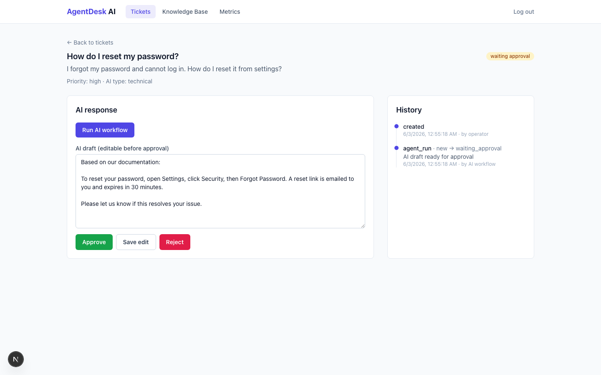
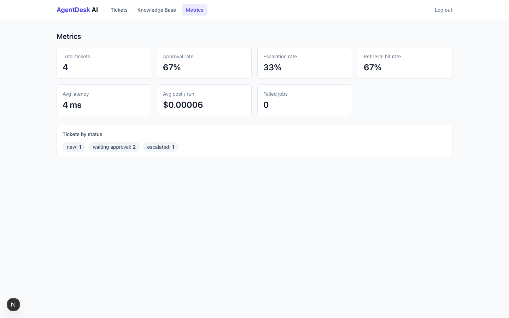

# AgentDesk AI — Human-in-the-loop AI SupportOps Platform

A multi-tenant SaaS backend + dashboard where support teams resolve tickets with an AI agent
**grounded in their own knowledge base (RAG)** — but **no AI reply is ever sent without human
approval**. Low-confidence cases are escalated. Every action is audited, measured, and can fan out to
external systems via signed webhooks.

> Built to demonstrate production-grade skills for **Python Backend**, **Applied AI / LLM·RAG**, and
> **Agentic Systems** roles: clean layered architecture, an explicit LangGraph workflow, pgvector
> retrieval, JWT + RBAC, Celery jobs, HMAC webhooks, structured audit logging, metrics, and a
> deterministic test suite that runs with **zero paid API calls**.

[](./.github/workflows/ci.yml)

---

## The problem

Companies want to use LLMs for customer support, but raw "AI auto-reply" is risky: models hallucinate,
leak, or answer confidently when they shouldn't. Teams need AI **leverage** without giving up
**control, traceability, and safety**.

## The solution

AgentDesk AI puts a human in the loop by design. An agentic workflow classifies a ticket, retrieves
relevant internal documentation, drafts a grounded reply, and **scores its own grounding**. Confident
drafts go to an operator for **approve / edit / reject**; weak ones are **escalated**. Everything is
recorded (audit log), measured (`/admin/metrics`), and integrated (signed webhooks).

---

## Architecture



**Agentic workflow (LangGraph):**



### Backend layers (clean architecture)

```
api/        HTTP routing + Pydantic I/O          (no business logic)
services/   business logic (tickets, retrieval, agent_run, webhook, metrics, audit)
models/     SQLAlchemy 2.0 (async) persistence
providers/  LLM/embedding interfaces → Mock (default) / Anthropic / OpenAI
agent/      LangGraph state, nodes, graph, cost
workers/    Celery app + tasks (agent run, webhook delivery)
```

---

## Stack

| Layer | Technology |
|------|------------|
| Backend | Python 3.11, FastAPI, SQLAlchemy 2.0 (async), Pydantic v2, Alembic |
| Data | PostgreSQL 16 + **pgvector** (relational + vector in one store) |
| Async jobs | Celery + Redis |
| Agentic | LangGraph |
| Auth | JWT (access + refresh) + RBAC (admin / operator / viewer) |
| Frontend | Next.js 15, TypeScript, TanStack Query, Tailwind CSS |
| Infra / CI | Docker Compose, GitHub Actions |
| Tests | pytest, pytest-asyncio (deterministic, mock providers, **no live LLM in CI**) |

---

## Features

- **Multi-tenant** — every entity scoped to an `Organization`; cross-tenant access denied.
- **Knowledge base (RAG)** — add docs, auto chunk + embed, semantic search with a configurable
  similarity threshold (pgvector cosine).
- **Tickets** — full lifecycle state machine (`new → triaged → draft_ready → waiting_approval →
  approved / rejected / escalated → closed`) with validated transitions and history.
- **Agentic workflow** — classifier → retriever → draft → **critic (grounding confidence)** → decision.
- **Human-in-the-loop** — approve / edit-then-approve / reject; actor + timestamp recorded.
- **Audit log** — 10 event types (ticket, agent, retrieval, draft, approval, rejection, escalation,
  webhook, login success/failure).
- **Metrics** — `/admin/metrics`: totals, by-status, avg latency, avg estimated cost, approval &
  escalation & retrieval-hit rates, failed jobs.
- **Webhooks** — per-org endpoint, **HMAC-SHA256 signed**, delivery records, bounded
  exponential-backoff retries via Celery.
- **Security** — no hardcoded secrets, input validation, configurable CORS, basic rate limiting,
  structured logging, errors that never leak internals.

---

## Screenshots

> _Placeholders — run the dashboard locally to capture._

| Login | Tickets | Ticket detail (HITL) | Metrics |
|---|---|---|---|
|  |  |  |  |

---

## Run locally (Docker Compose)

```bash
cp .env.example .env          # defaults work out-of-the-box (mock providers, no API keys)
docker compose up --build     # db (pgvector) + redis + backend + worker
# include the dashboard:
docker compose --profile frontend up --build
```

- API docs (Swagger): http://localhost:8000/docs
- Dashboard: http://localhost:3000
- Health: http://localhost:8000/api/v1/health

Migrations (including `CREATE EXTENSION vector`) run automatically on backend start.

### End-to-end smoke flow

1. Register an org + admin → log in.
2. Add a knowledge-base document.
3. Create a ticket → **Run AI workflow**.
4. Review the grounded draft → **approve / edit / reject** (or see it **escalated**).
5. Inspect the ticket's audit history; view `/admin/metrics`; a signed webhook fires on approve/escalate.

Full walkthrough: [`specs/001-agentdesk-mvp/quickstart.md`](specs/001-agentdesk-mvp/quickstart.md).

---

## Run the tests

```bash
cd backend
pip install ".[dev]"
LLM_PROVIDER=mock EMBEDDING_PROVIDER=mock pytest -q   # 42 tests, deterministic, offline
ruff check app tests
mypy app

cd ../frontend
npm install
npx tsc --noEmit
npm run build
```

CI ([`.github/workflows/ci.yml`](.github/workflows/ci.yml)) runs backend `ruff` + `mypy` + Alembic
migrations (against real Postgres+pgvector) + `pytest` with mock providers, and the frontend
typecheck + build — **no API keys, no live LLM calls**.

---

## Environment variables

See [`.env.example`](.env.example). Highlights:

| Var | Default | Purpose |
|-----|---------|---------|
| `DATABASE_URL` | postgres+asyncpg… | PostgreSQL connection |
| `REDIS_URL` | redis://redis:6379/0 | Celery broker/backend |
| `JWT_SECRET` | _(set me)_ | token signing |
| `ACCESS_TOKEN_MINUTES` / `REFRESH_TOKEN_DAYS` | 30 / 7 | token lifetimes |
| `LLM_PROVIDER` / `EMBEDDING_PROVIDER` | mock | `mock` \| `anthropic` \| `openai` |
| `EMBEDDING_DIM` | 384 | embedding size |
| `CONFIDENCE_THRESHOLD` | 0.7 | waiting_approval vs escalated |
| `SIMILARITY_THRESHOLD` | 0.5 | retrieval cutoff |
| `WEBHOOK_MAX_RETRIES` | 5 | bounded retries |
| `CORS_ORIGINS` / `RATE_LIMIT_PER_MINUTE` | localhost / 120 | HTTP hardening |
| `ANTHROPIC_API_KEY` / `OPENAI_API_KEY` | _(empty)_ | optional, only for real providers |

---

## Technical decisions

- **pgvector over a separate vector DB** — one datastore means tenant-scoped joins, transactional
  consistency, and simpler ops. A portable column type uses a real `vector(384)` + cosine index on
  Postgres and falls back to JSON + in-Python cosine on SQLite, so tests stay **fast and offline**.
- **Providers behind interfaces** — `LLMProvider` / `EmbeddingProvider` with a deterministic
  `MockProvider` default; vendor SDKs are lazy-imported only inside their adapters. This is what keeps
  CI free of paid APIs and makes the agent workflow reproducible.
- **Async via Celery, with an eager flag** — the API enqueues `run_agent` and returns `202`; an
  `AGENT_RUN_EAGER` flag runs it inline for tests/demos so no worker is required.
- **Spec-driven** — the full spec/plan/tasks live under [`specs/001-agentdesk-mvp/`](specs/001-agentdesk-mvp/),
  governed by a project [constitution](.specify/memory/constitution.md).

---

## What this project demonstrates

- Designing and shipping a **non-trivial, multi-module backend** with clean separation of concerns.
- A real **agentic RAG pipeline** (LangGraph) with retrieval grounding and a self-critique gate.
- **Production concerns end to end**: auth, RBAC, multi-tenancy, migrations, background jobs, signed
  webhooks with retries, audit logging, metrics, rate limiting, structured logs.
- **Testability discipline** — deterministic, offline tests covering auth/RBAC, tickets, ingestion,
  retrieval, the workflow, approvals, webhook signatures, audit, and metrics.
- **Type-safety & quality gates** — `mypy` and `ruff` clean, enforced in CI.

## Why this matters for Applied AI / Backend roles

This is the shape of a real internal AI product: not a chatbot demo, but a **governed system** where
AI proposes and humans dispose, with the observability and integration hooks an organization actually
needs to trust it in production. It shows I can take an ambiguous "use AI for support" goal and deliver
a secure, tested, deployable service with a clear human-oversight story.

---

## License

MIT
